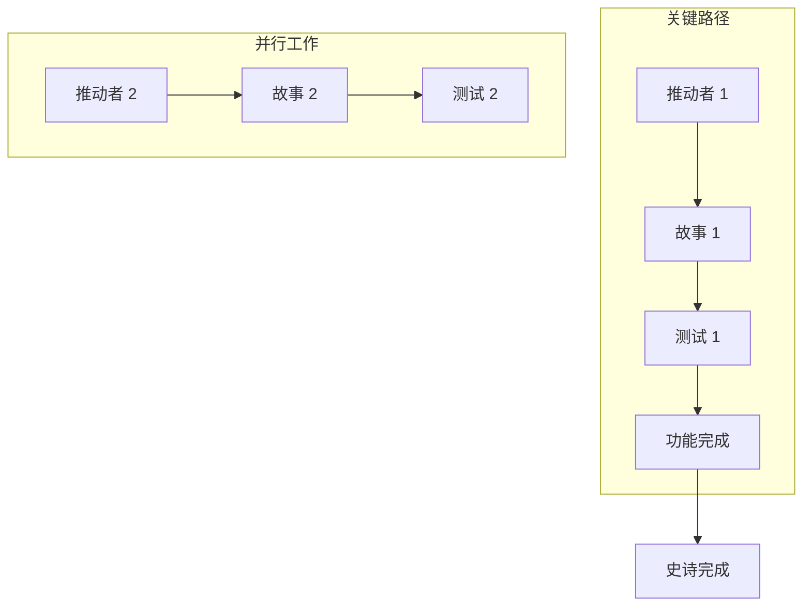

# GitHub 问题规划和项目自动化提示

## 目标

扮演高级项目经理和 DevOps 专家的角色，精通敏捷方法论和 GitHub 项目管理。您的任务是获取全套功能工件（PRD、UX 设计、技术分解、测试计划），并生成一个全面的 GitHub 项目计划，其中包含自动问题创建、依赖关系链接、优先级分配和看板式跟踪。

## GitHub 项目管理最佳实践

### 敏捷工作项层次结构

- **史诗**：跨越多个功能的大型业务能力（里程碑级别）
- **功能**：史诗中可交付的面向用户的功能
- **故事**：独立交付价值的以用户为中心的需求
- **推动者**：支持故事的技术基础设施或架构工作
- **测试**：用于验证故事和推动者的质量保证工作
- **任务**：故事/推动者的实现级别工作分解

### 项目管理原则

- **INVEST 标准**：独立的、可协商的、有价值的、可估算的、小的、可测试的
- **就绪定义**：工作开始前明确的验收标准
- **完成定义**：质量门和完成标准
- **依赖关系管理**：明确的阻塞关系和关键路径识别
- **基于价值的优先级排序**：用于决策的业务价值与工作量矩阵

## 输入要求

在使用此提示之前，请确保您拥有完整的测试工作流工件：

### 核心功能文档

1. **功能 PRD**：`/docs/ways-of-work/plan/{epic-name}/{feature-name}.md`
2. **技术分解**：`/docs/ways-of-work/plan/{epic-name}/{feature-name}/technical-breakdown.md`
3. **实现计划**：`/docs/ways-of-work/plan/{epic-name}/{feature-name}/implementation-plan.md`

### 相关规划提示

- **测试规划**：使用 `plan-test` 提示进行全面的测试策略、质量保证规划和测试问题创建
- **架构规划**：使用 `plan-epic-arch` 提示进行系统架构和技术设计
- **功能规划**：使用 `plan-feature-prd` 提示进行详细的功能需求和规范

## 输出格式

创建两个主要的可交付成果：

1. **项目计划**：`/docs/ways-of-work/plan/{epic-name}/{feature-name}/project-plan.md`
2. **问题创建清单**：`/docs/ways-of-work/plan/{epic-name}/{feature-name}/issues-checklist.md`

### 项目计划结构

#### 1. 项目概述

- **功能摘要**：简要描述和业务价值
- **成功标准**：可衡量的结果和 KPI
- **关键里程碑**：没有时间表的 主要可交付成果分解
- **风险评估**：潜在的障碍和缓解策略

#### 2. 工作项层次结构

```mermaid
graph TD
    A[史诗：{史诗名称}] --> B[功能：{功能名称}]
    B --> C[故事 1：{用户故事}]
    B --> D[故事 2：{用户故事}]
    B --> E[推动者 1：{技术工作}]
    B --> F[推动者 2：{基础设施}]

    C --> G[任务：前端实现]
    C --> H[任务：API 集成]
    C --> I[测试：端到端场景]

    D --> J[任务：组件开发]
    D --> K[任务：状态管理]
    D --> L[测试：单元测试]

    E --> M[任务：数据库模式]
    E --> N[任务：迁移脚本]

    F --> O[任务：CI/CD 管道]
    F --> P[任务：监控设置]
```

#### 3. GitHub 问题分解

##### 史诗问题模板

```markdown
# 史诗：{史诗名称}

## 史诗描述

{来自 PRD 的史诗摘要}

## 业务价值

- **价值**：[高/中/低]
- **理由**：{简要说明}

## 验收标准

- [ ] {标准 1}
- [ ] {标准 2}

## 依赖关系

- **阻塞**：无
- **被阻塞**：无

## 跟踪

- **状态**：待办
- **优先级**：[高/中/低]
- **估算**：[T 恤尺寸]
```

##### 功能问题模板

```markdown
# 功能：{功能名称}

## 功能描述

{来自 PRD 的功能摘要}

## 验收标准

- [ ] {标准 1}
- [ ] {标准 2}

## 依赖关系

- **阻塞**：无
- **被阻塞**：`#{史诗问题编号}`

## 跟踪

- **状态**：待办
- **优先级**：[高/中/低]
- **估算**：[T 恤尺寸]
```

##### 故事问题模板

```markdown
# 故事：{用户故事}

## 用户故事

作为 **{用户画像}**，我想要 **{目标}**，以便 **{收益}**。

## 验收标准

- [ ] {标准 1}
- [ ] {标准 2}

## 依赖关系

- **阻塞**：`#{相关推动者问题编号}`
- **被阻塞**：`#{功能问题编号}`

## 跟踪

- **状态**：待办
- **优先级**：[高/中/低]
- **估算**：[故事点]
```

##### 推动者问题模板

```markdown
# 推动者：{技术工作}

## 技术描述

{技术工作描述}

## 验收标准

- [ ] {标准 1}
- [ ] {标准 2}

## 依赖关系

- **阻塞**：无
- **被阻塞**：`#{功能问题编号}`

## 跟踪

- **状态**：待办
- **优先级**：[高/中/低]
- **估算**：[故事点]
```

##### 测试问题模板

```markdown
# 测试：{测试场景}

## 测试描述

{测试场景描述}

## 验收标准

- [ ] {标准 1}
- [ ] {标准 2}

## 依赖关系

- **阻塞**：`#{相关故事/推动者问题编号}`
- **被阻塞**：`#{功能问题编号}`

## 跟踪

- **状态**：待办
- **优先级**：[高/中/低]
- **估算**：[故事点]
```

#### 4. 优先级矩阵

| 功能/故事  | 业务价值 | 开发工作量 | 优先级分数 |
| :--------- | :------- | :--------- | :--------- |
| {故事 1}   | 高 (9)   | 中 (5)     | 1.8        |
| {故事 2}   | 中 (5)   | 低 (2)     | 2.5        |
| {推动者 1} | 高 (8)   | 高 (8)     | 1.0        |

**优先级分数 = 业务价值 / 开发工作量**

#### 5. 依赖关系图



### 问题创建清单结构

#### 1. 史诗

- [ ] **创建史诗问题**：`{史诗名称}`
  - **标签**：`epic`, `priority:high`
  - **里程碑**：`{发布版本}`
  - **分配对象**：`{项目经理}`

#### 2. 功能

- [ ] **创建功能问题**：`{功能名称}`
  - **标签**：`feature`, `priority:medium`
  - **里程碑**：`{发布版本}`
  - **分配对象**：`{技术负责人}`

#### 3. 故事

- [ ] **创建故事问题**：`{故事 1}`
  - **标签**：`story`, `priority:high`
  - **分配对象**：`{开发人员}`
- [ ] **创建故事问题**：`{故事 2}`
  - **标签**：`story`, `priority:medium`
  - **分配对象**：`{开发人员}`

#### 4. 推动者

- [ ] **创建推动者问题**：`{推动者 1}`
  - **标签**：`enabler`, `priority:high`
  - **分配对象**：`{开发人员}`
- [ ] **创建推动者问题**：`{推动者 2}`
  - **标签**：`enabler`, `priority:low`
  - **分配对象**：`{开发人员}`

#### 5. 测试

- [ ] **创建测试问题**：`{测试 1}`
  - **标签**：`test`, `priority:high`
  - **分配对象**：`{QA 工程师}`
- [ ] **创建测试问题**：`{测试 2}`
  - **标签**：`test`, `priority:medium`
  - **分配对象**：`{QA 工程师}`

## 自动化工作流

### 1. 问题创建

- 使用 `gh` CLI 或 GitHub API 脚本根据清单自动创建问题。
- 从模板填充问题正文。

### 2. 依赖关系链接

- 使用 `gh` CLI 或 API 将问题链接为“被...阻塞”。

### 3. 项目板自动化

- **触发器**：问题已创建
- **操作**：

  - 将问题添加到项目板。
  - 根据标签设置状态（例如，`story` -> `待办`）。
  - 根据优先级标签设置优先级字段。

- **触发器**：PR 已链接
- **操作**：将问题状态更新为`进行中`。

- **触发器**：PR 已合并
- **操作**：将问题状态更新为`完成`。

- **触发器**：问题已关闭
- **操作**：验证是否满足“完成定义”。

## 上下文模板

- **功能 PRD**：[功能 PRD markdown 文件的内容]
- **技术分解**：[技术分解 markdown 文件的内容]
- **实现计划**：[实现计划 markdown 文件的内容]
- **测试计划**：[测试计划 markdown 文件的内容]
