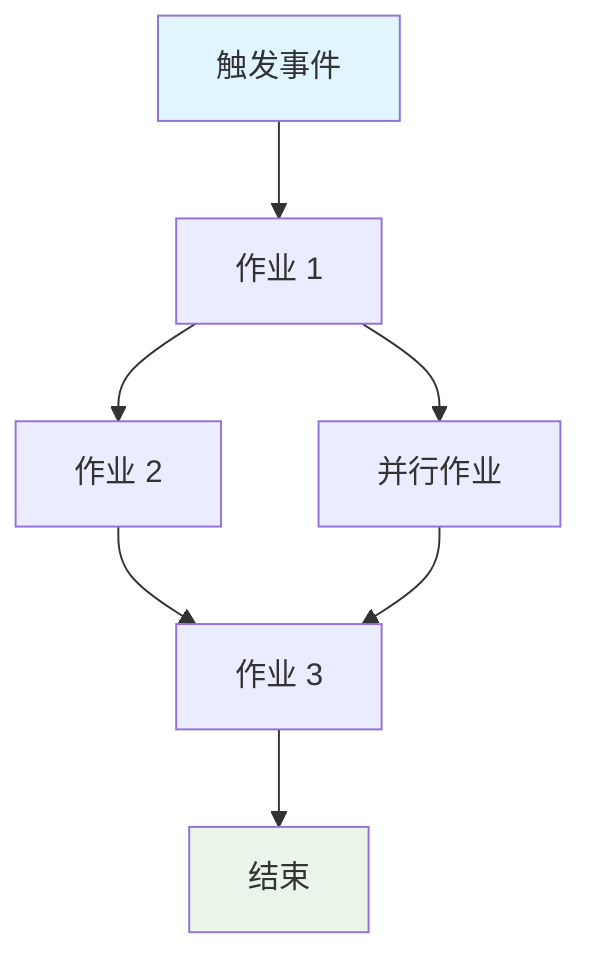

````markdown
---
mode: "agent"
description: "为现有的 GitHub Actions CI/CD 工作流创建正式规范，优化 AI 使用和工作流维护。"
tools: ["changes", "codebase", "editFiles", "extensions", "fetch", "findTestFiles", "githubRepo", "new", "openSimpleBrowser", "problems", "runCommands", "runInTerminal2", "runNotebooks", "runTasks", "runTests", "search", "searchResults", "terminalLastCommand", "terminalSelection", "testFailure", "usages", "vscodeAPI", "microsoft.docs.mcp", "github", "Microsoft Docs"]
---

# 创建 GitHub Actions 工作流规范

为 GitHub Actions 工作流创建全面规范：`${input:WorkflowFile}`。

此规范作为工作流行为、需求和约束的规范。它必须与实现无关，专注于工作流**完成什么**，而不是**如何**实现。

## AI 优化要求

- **令牌效率**：使用简洁的语言，不牺牲清晰度
- **结构化数据**：利用表格、列表和图表来表示密集信息
- **语义清晰**：始终如一地使用精确的术语
- **实现抽象**：避免特定的语法、命令或工具版本
- **可维护性**：设计为随着工作流的演变而易于更新

## 规范模板

另存为：`/spec/spec-process-cicd-[workflow-name].md`

````md
---
title: CI/CD 工作流规范 - [工作流名称]
version: 1.0
date_created: [YYYY-MM-DD]
last_updated: [YYYY-MM-DD]
owner: DevOps 团队
tags: [process, cicd, github-actions, automation, [特定领域标签]]
---

## 工作流概述

**目的**：[一句话描述工作流的主要目标]
**触发事件**：[列出触发条件]
**目标环境**：[环境范围]

## 执行流程图


````
````

## 作业和依赖项

| 作业名称 | 目的   | 依赖项     | 执行上下文    |
| -------- | ------ | ---------- | ------------- |
| job-1    | [目的] | [先决条件] | [运行器/环境] |
| job-2    | [目的] | job-1      | [运行器/环境] |

## 需求矩阵

### 功能需求

| ID      | 需求   | 优先级 | 验收标准     |
| ------- | ------ | ------ | ------------ |
| REQ-001 | [需求] | 高     | [可测试标准] |
| REQ-002 | [需求] | 中     | [可测试标准] |

### 安全需求

| ID      | 需求       | 实现约束   |
| ------- | ---------- | ---------- |
| SEC-001 | [安全需求] | [约束描述] |

### 性能需求

| ID       | 指标   | 目标     | 测量方法   |
| -------- | ------ | -------- | ---------- |
| PERF-001 | [指标] | [目标值] | [如何测量] |

## 输入/输出合同

### 输入

```yaml
# 环境变量
ENV_VAR_1: string # 目的: [描述]
ENV_VAR_2: secret # 目的: [描述]

# 存储库触发器
paths: [路径过滤器列表]
branches: [分支模式列表]
```

### 输出

```yaml
# 作业输出
job_1_output: string # 描述: [目的]
build_artifact: file # 描述: [内容类型]
```

```

```
